# Android Tasks - 2

# *Level 1: Insecure Logging*

### The Challenge

When you open Level 1 in the DIVA app, you are greeted with a very simple screen: a text box asking for a credit card number and a "Checkout" button.

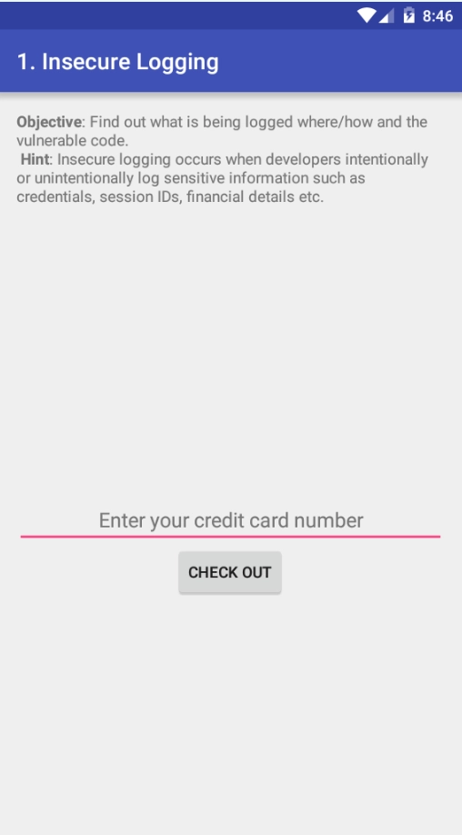

It looks like a normal payment page, but we want to see what the app is secretly doing with that data in the background.

### Understanding the Vulnerability

Basically, when developers build apps, they leave a bunch of "debug messages" on so they can track errors and see what the code is doing. This is super helpful during development.                      **Insecure Logging** happens when they forget to turn those messages off before putting the app out there. If the app is logging sensitive stuff—like the credit card number we just typed—anyone who plugs the phone into a computer can literally just read it.

### The Exploit

Instead of tearing apart the source code right away, I just did a live test to see how the app behaved while it was running.

Here’s exactly what I did:

1. First, I just typed a totally fake credit card number into the app's text box, I used - 1234 1234 1234 1234  and clicked the Checkout button.

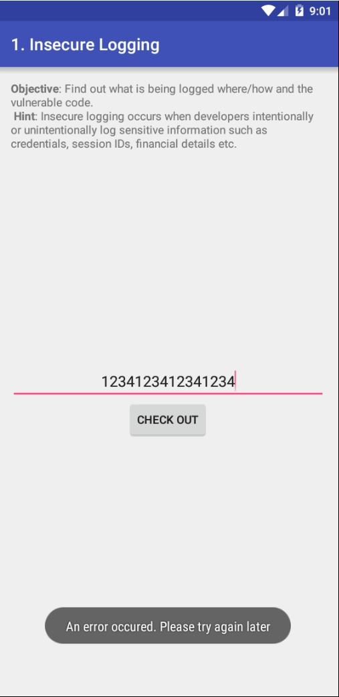

2. Next, I connected my device, opened up my Windows Command Prompt (CMD), and pulled up the system logs. Android devices are constantly spitting out background logs, which you can read using a tool called  “ logcat “, because logcat  dumps thousands of lines of text a second, I used the Windows “ findstr “ command to filter out all the junk and only show me logs from the "diva" app.

Command : adb logcat | findstr “diva”

1. As soon as I hit enter, the terminal printed out the app's background processes. Right there, sitting in plain text, was my exact credit card number.

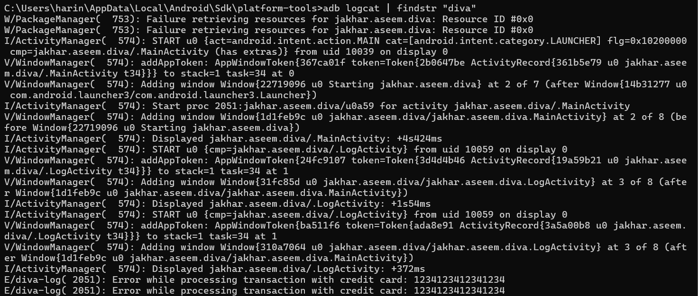

### The Fix

fixing this is pretty easy:

- **The quick fix:** Go through the source code and manually delete every “Log.d” or “System.out.println” line that handles private user data.
- **The smart fix:** Use a tool like **ProGuard**. You can configure it to automatically strip out all the logging code the second you build the final release version of the app.

# *Level 2: Hardcoding Issues - Part 1*

### The Challenge

When you open Level 2, the app throws a lock screen at you asking for a "vendor secret key" to proceed.

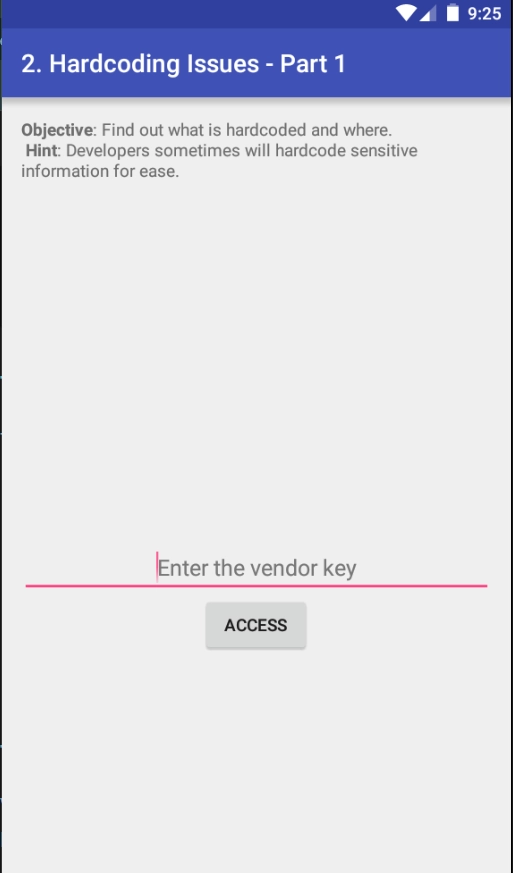

The goal here is to figure out if the developer got lazy and just typed that secret key directly into the application's code, assuming nobody would ever be able to read it.

### Understanding the Vulnerability

This is a classic case of hardcoding secrets. Sometimes developers assume that once an app is compiled and pushed to the app store, nobody can read the original source code.

But Android apps (APKs) are basically just zipped folders. If you hardcode a password or an API key directly into the Java files, anyone with basic tools can unpack the app and read your code like an open book.

### The Exploit

For this one, I didn't even mess with the live app at first. Instead, I grabbed the app's APK file and threw it into a decompiler called **Jadx**.

Here is exactly how I found it:

1. Once Jadx unpacked the code, I manually searched through the app's package files looking for anything related to the hardcode level.
2. I found the specific activity running that screen: HardcodeActivity.
3. I opened that file up, and sure enough, right there in plain sight, the developer had written an if  statement checking my input against a hardcoded string. The password was literally just sitting there in plain text: “vendorsecretkey”.

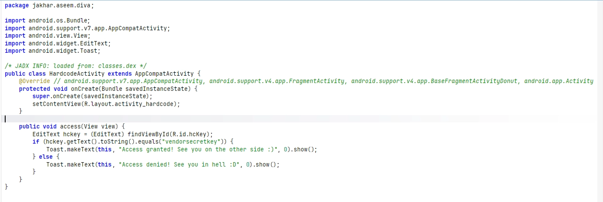

Exploiting it was as easy as it gets:
4. I went back to the live DIVA app and opened the Level 2 screen.
5. I typed the password I found (vendorsecretkey) directly into the text box.
6. I clicked "Access" and the app let me right in.

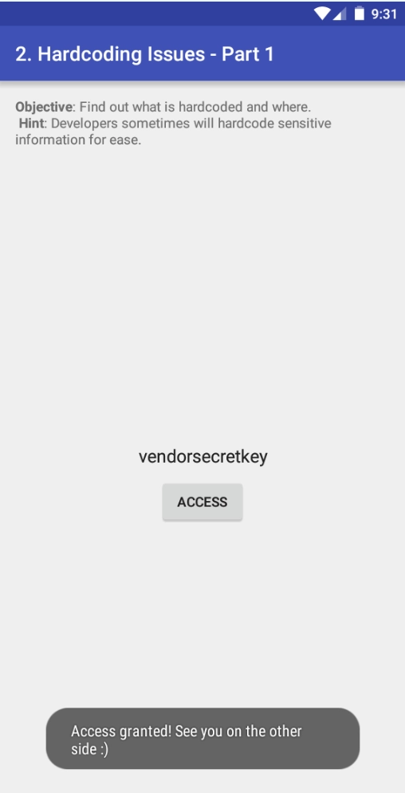

### The Fix

The fix for this is super simple: never, ever hardcode passwords, API keys, or security tokens directly into your source code. Instead, the app should authenticate the user and fetch the key securely from a backend server, or store it using the Android Keystore system.

# *Level 3: Insecure Data Storage - Part 1*

### The Challenge

When you open up Level 3, the app gives you a very simple form asking you to enter a username and a password. When you click the "Save" button, it supposedly locks them away safely.

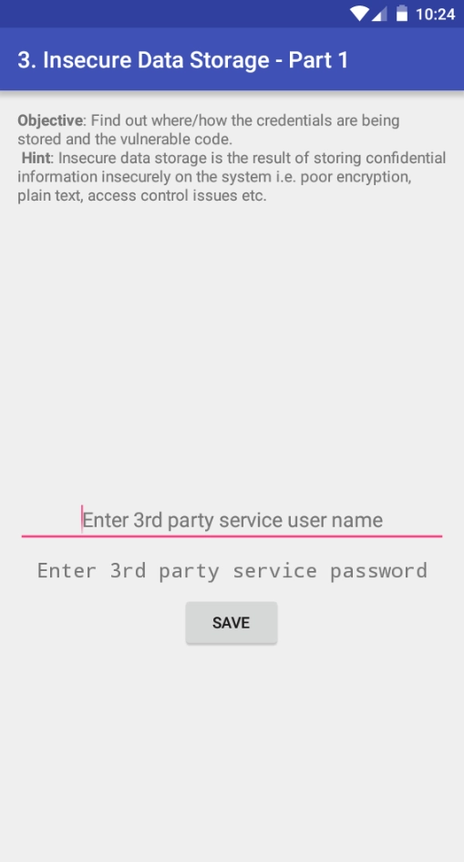

The goal here is to figure out exactly *where* and *how* the app is saving that data on the phone, and see if we can steal it.

### Understanding the Vulnerability

Android has a built-in feature called SharedPreferences. It’s meant for saving simple, harmless preferences like "Dark Mode = On" or "High Score = 500."
Developers sometimes get lazy and use SharedPreferences to save highly sensitive information—like passwords or session tokens. The problem is that standard SharedPreferences saves data in a plain text XML file hidden inside the phone's internal file system. It has absolutely zero encryption. If an attacker gets file-system access (like if the phone is rooted, or through a malicious backup), they can just open the file and read it like a normal text document.

### The Exploit

For this one, I wanted to dig directly into the phone's internal storage and see what was happening behind the scenes.

Here is exactly how I stole the credentials:

1. First, I opened the DIVA app to Level 3, typed in some fake data (admin and secret), and hit “Save”.

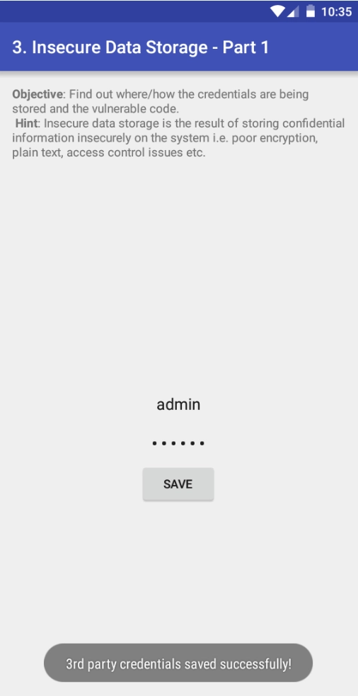

1. Next, I opened my Windows CMD and connected to my device’s shell - adb shell.
2. To get inside the app’s secure sandbox, I used the run-as command. This essentially tells the phone to give the exact same permissions as this specific app.  

command : run-as jakhar.aseem.diva

1. Once I was in, I used the “ls” command to list out the directories and look around the files. I spotted a folder named “shared_prefs” and navigated into it.
2. Inside I found a file named “jakhar.aseem.diva_preferences.xml”. I opened it using the cat command.
Command : cat jakhar.aseem.diva_preferences.xml
3. Terminal shows all the contents of the file and my username and password written as a plain text.

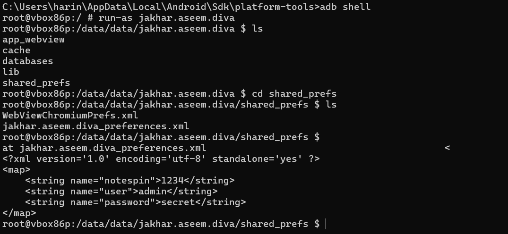

### The Fix

The fix for this is incredibly straightforward. Developers need to stop using regular “SharedPreferences” for sensitive data. Instead, they should swap it out for Android's “EncryptedSharedPreferences” library. It works exactly the same way for the developer to write the code, but it automatically encrypts the data under the hood so it just looks like total gibberish to anyone trying to read the file.

# *Level 4: Insecure Data Storage - Part 2*

### The Challenge

When you open Level 4, the app gives you another form asking you to enter a username and a password, just like the previous level.

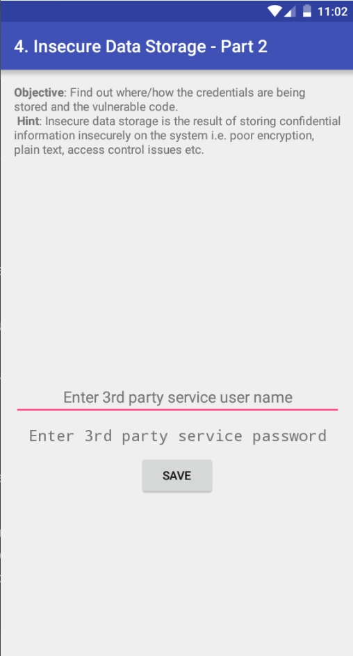

The goal here is exactly the same: find out where the app is storing this information and see if it is properly protected or just sitting out in the open.

### Understanding the Vulnerability

In the previous level, the developer used “Sharedpreferences” (XML files). For this level, they upgraded to using a full **SQLite database** to store the credentials.

SQLite is the default database system built into Android. It's incredibly useful for developers, but it has the exact same fatal flaw as standard SharedPreferences : by default, the database is totally unencrypted. If an attacker can get into the app's hidden data folder, they can just open the database file and read all the rows and columns in plain text.

### The Exploit

To crack this, I used my terminal to go into the phone and manually query the app's internal database.

Here is exactly how I did that :

1. First, I opened the DIVA app to Level 4, typed some fake credentials into the form (like username and secret), and clicked save.

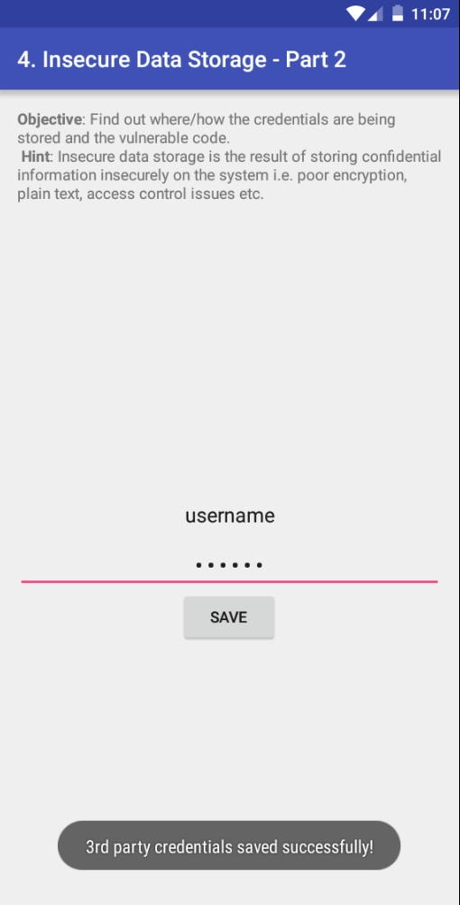

1. Next, I opened my windows command terminal and got into the device shell, then used the run-as command to get inside the app’s secure sandbox
Command : 
adb shell
run-as jakhar.aseem.diva
2. Once I got in, I checked for the folders inside using “ls” and then found a folder named  “databases” and that is where Android keeps SQLite files so I navigated into that folder using “cd databases”.
3. I found a database file named “ids2” - which stands for insecure data storage 2. To open  it, I launched the built-in SQLite tool right there in the terminal.
Command : sqlite3 ids2
4. After I got inside I checked for tables using “.tables” command and It showed a table named “myuser”.
5. Finally I ran a standard SQL command to dump everything inside that table 
Command : SELECT * FROM myuser;
6. Then terminal printed out all the contents of the database, my username and password were present in the form of plain text there.

               

### The Fix:

Instead of using the default Android database, developers should use a secure alternative like **SQLCipher**. It works exactly the same way when you are coding the app, but it automatically scrambles (encrypts) the data before saving it to the phone. If a developer used SQLCipher and I tried to run those exact same terminal commands, instead of seeing the password, all I would see is unreadable gibberish.

# *Level 5: Insecure Data Storage - Part 3*

### The Challenge

When you open Level 5, the app gives you yet another form asking for a username and password.

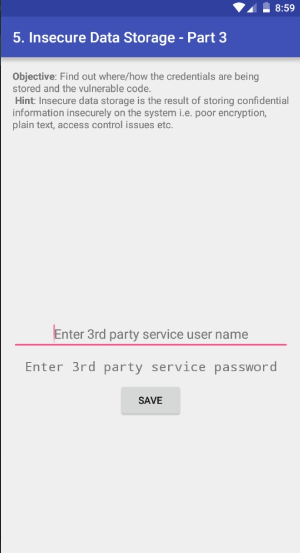

Just like the previous storage levels, the goal is to figure out where the developer is hiding this information and prove that it is not properly secured.

### Understanding the Vulnerability

In the previous levels, we saw the developer use Sharedpreferences(XML)  and SQLite (Databases) to store the sensitive information. Now the developer used temporary file to store the sensitive information like the username and password.

The problem in storing in a temporary file is that the Android doesn’t automatically encrypt anything. It is just a basic text file sitting inside the app’s internal directory and anyone who has access to the app’s folder can open the file and read it instantly.

### The Exploit

1. First, I opened my Windows CMD and jumped into the device shell, using run-as command to get inside the app's secure sandbox.
Commands : 
adb shell
run-as jakhar.aseem.diva 
2. While I was in the main directory (/data/data/jakhar.aseem.diva/), I ran a simple ls command to see what files were already there. I made a mental note of the current folder contents.
3. Next, I went to the live DIVA app on Level 5, typed some fake credentials into the form, and clicked save.

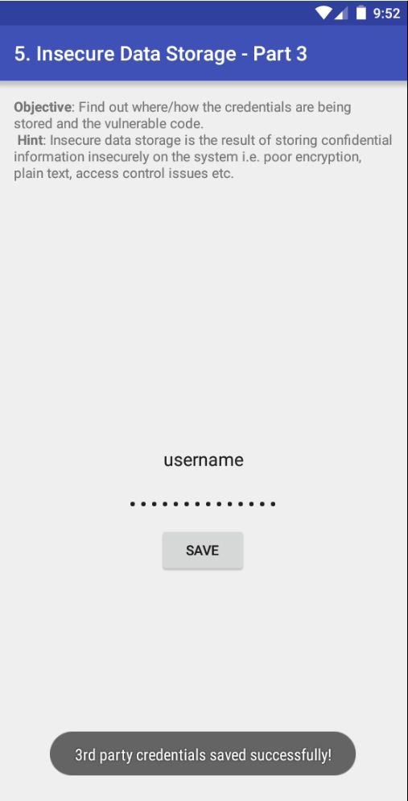

1. I immediately went back to my terminal and ran ls again.
2. Suddenly, a brand new file had magically appeared in the list: uinfo-806280132tmp. Since it wasn't there a minute ago, I knew exactly where the app had just dumped my data.

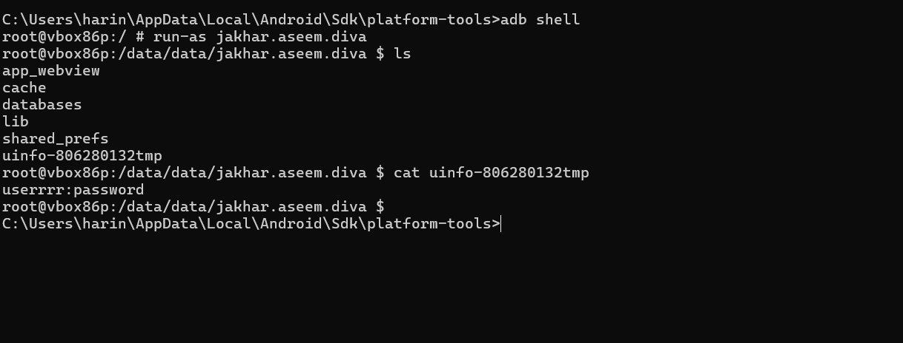

### The Fix

You just can’t save sensitive stuff like passwords in a normal, unencrypted file, even if it has a randomized temporary name. If a developer needs to write sensitive data to a local file, they must use Android’s Encrypted File library. This ensures that the data is automatically scrambled before it is ever written to the phone's storage. If a developer used that library and I tried to run those exact same terminal commands on the temporary file, all I would see is unreadable gibberish.

# *Level 6: Insecure Data Storage - Part 4*

### The Challenge

When you open Level 6, you get another familiar form asking you to enter a username and a password.

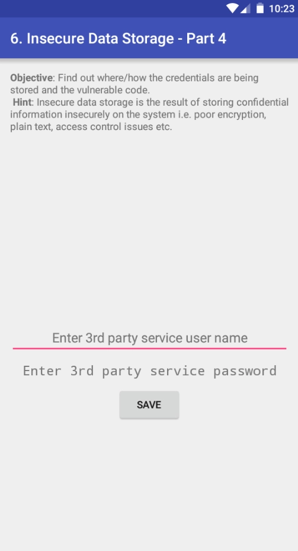

The goal for this level is to find out where exactly this saved data is being stored and check if it is vulnerable.

### Understanding the Vulnerability

In previous levels, the developer hid data in internal XML files, SQLite databases, and internal temporary files. In this level they have used external storage to store them.

The problem with the external storage on Android is that it is public by design. Any app on the phone with the basic READ_EXTERNAL_STORAGE permission can access files saved there. It is the absolute worst place to store sensitive data like passwords because it sits entirely outside of the app's secure internal sandbox.

### The Exploit

This time before even going to the terminal, I used jadx to look at the source code of the app so that I wouldn’t have to guess where the file was saved as I can just check for the permissions in the android manifest.xml file so, I checked the file and saw the app asking the WRITE_EXTERNAL-STORAGE permission which is a huge red flag. Then, I looked at the Java code for the Level 6 screen. Inside the function for the "Save" button, the developer used the command Environment.getExternalStorageDirectory(). In Android, "External Storage" is just the official system name for the “sdcard“ folder. So, as soon as I read that line of code, I knew exactly which folder to target.

1. First, I opened the DIVA app to Level 6, typed in some fake credentials, and clicked save.

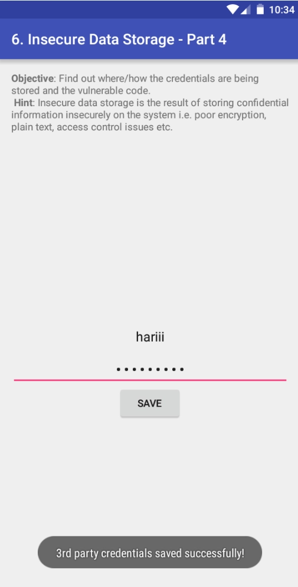

1. Next, I went into the device shell and instead of navigating to the app’s private data folder, I went straight to the phone's external storage directory that I found in the code.
Command : cd  /sdcard/
2. Then I ran ls -a to access the hidden files and noticed a file named “.uinfo.txt”.  They have put a dot in beginning of the filename which doesn’t encrypt anything so, I just used cat command to read the contents of the file.
3. Then, I found all the details in plain text format.

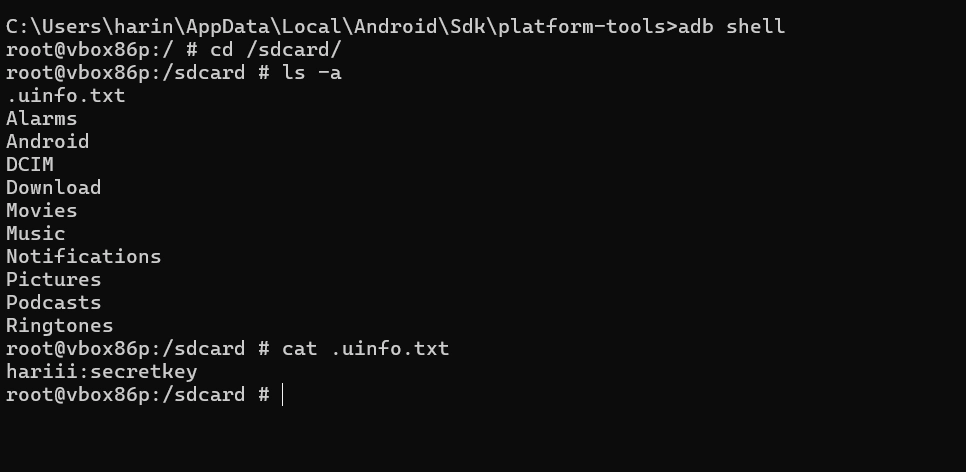

### The Fix

You can never sensitive information on external storage, as external storage is meant for public files like photos, music. You should try to use EncryptedSharedPreferences library inside the app’s internal sandboxed storage.

# *Level 7: Input Validation Issues - Part 1*

### The Challenge

When you open Level 7, the app gives you a simple search box and asks you to search for a user.

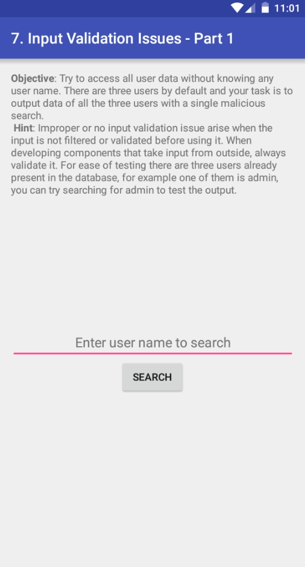

The goal of this level is to find out if we are able to access the information we aren’t supposed to access by giving some input for making the app give the app give the info by itself.

### Understanding the Vulnerability

This vulnerability is called **SQL Injection**.

When you type a name into a search box, the app takes that name and inserts it into a database command (a SQL query) to look it up. The problem happens when the developer trusts the user too much and pastes their input directly into the command without filtering it. If anyone types in special database characters instead of a normal name, they can actually rewrite the app's database command on the fly, forcing the database to hand over everything.

### The Exploit

First I decompiled the app using Jadx and looked at the java code for the level - 7 search and I found the line where developer talks to the database in the SQLInjectionActivity. 
Line : `"SELECT * FROM sqliuser WHERE user = '" + srchtxt.getText().toString() + "'", null)`

By reading the code we can understand that  it was directly concatenating my input and the developer was wrapping the input using single quotes (’), then I designed a precise payload to break out of those single quotes and force the database to give me all the information.
payload : 1’ OR ‘1’ = ‘1

Then I went to the app and by giving this as input I got all the details 

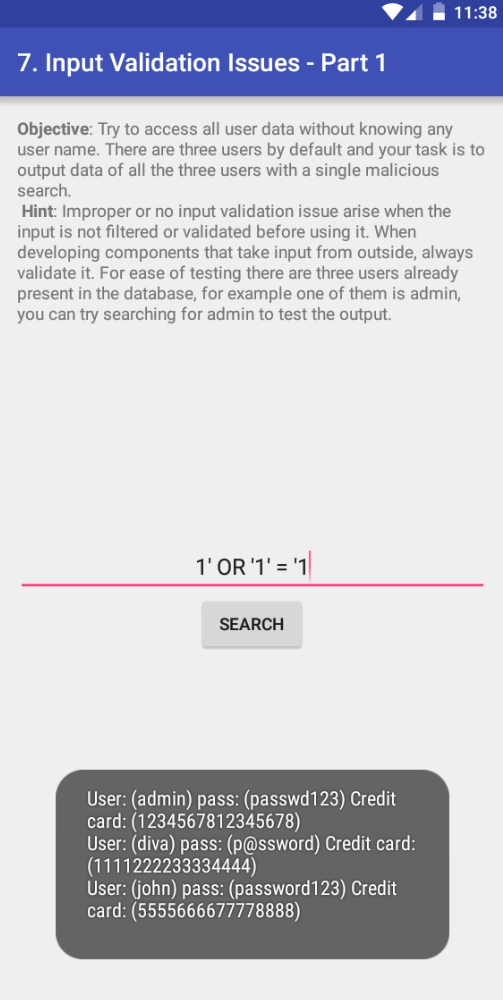

### The Fix

First one is to never trust the user input, they must use **Parameterized Queries** (or Prepared Statements). This forces the database engine to treat whatever the user types as pure, harmless text, not as executable code. If the developer used Parameterized Queries and I typed 1’ OR ‘1’ = ‘1, the app would safely search for a person literally named "1' OR '1'='1" and simply return zero results.

# *Level 8: Input Validation Issues - Part 2*

### The Challenge

When you open Level 8, the app gives you a text box and asks you to enter a URL for it to load, functioning like a mini web browser.

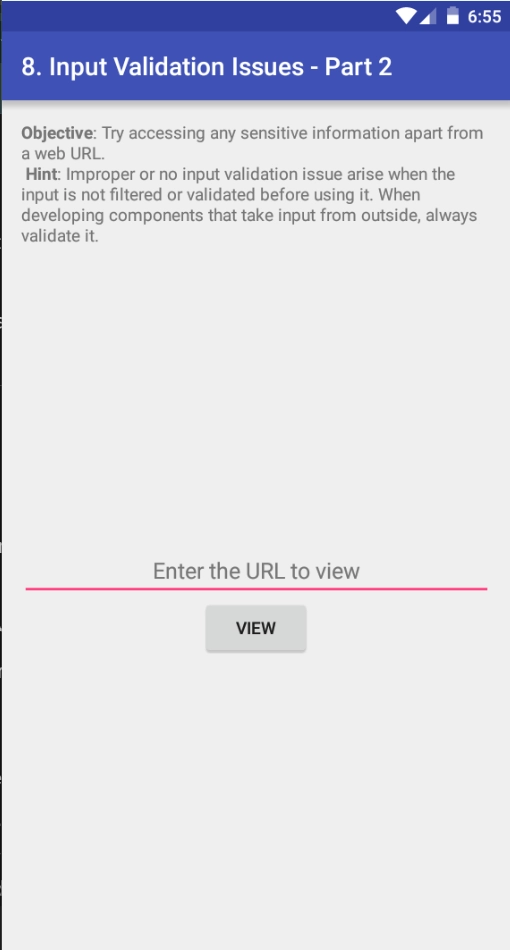

The goal for this level is to check if we can abuse the browser to look at the things other than standard websites.

### Understanding the Vulnerability

In Android, developers often use a tool called a **WebView** to display web pages inside their apps. The vulnerability here is a lack of input validation combined with dangerous default settings. WebViews are designed to open http:// and https:// links, but by default, they are also capable of opening local device files using the file:// scheme. If a developer doesn't explicitly check what the user typed and restrict the input to web links only, an attacker can use the app's own browser to view highly sensitive files hidden inside the app's secure sandbox.

### The Exploit

1. As I already knew from the previous levels where the data is stored inside the app so I just tried giving a specific payload pointing to the exact location where the Android stores SharedPreferences files.
2. I entered the following payload into the URL box :
file:///data/data/jakhar.aseem.diva/shared_prefs/jakhar.aseem.diva_preferences.xml
3. When I clicked the button to load the view then the WebView instantly bypassed all authentication and displayed the raw XML file right on the screen. The usernames and passwords from a previous level were just written in a plain text.

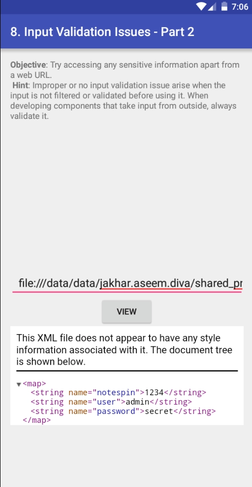

### The Fix

First, the app should check the  user’s input before loading it. The app should strictly check whether the input begins with http:// or https:// only next, the developer should tell the webview to not allowed to read local files by setting.

# *Level 9: Access Control Issues - Part 1*

### The Challenge

For this level, the app contains a hidden screen holding sensitive API credentials. Normally, you would need to click specific buttons or pass an authentication check within the app to reach it.

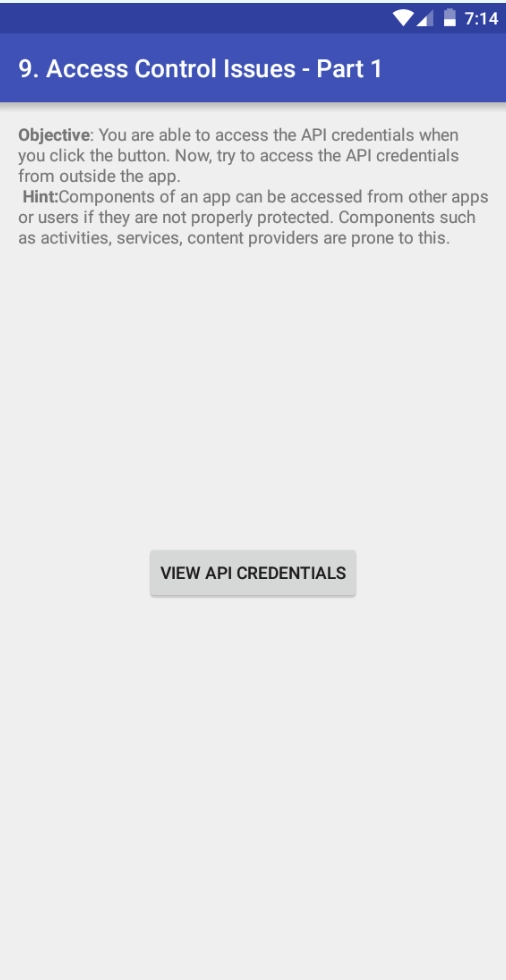

The goal of this level is to find out if we will be able to bypass the app’s intended flow and force that secret screen to open without ever clicking a button.

### Understanding the Vulnerability

Android apps are built using individual screens called **Activities**, and they are all listed in a master file called the “AndroidManifest.xml”.

Usually, to make a private screen accessible to the outside world, a developer has to explicitly write android:exported=”true”. However, there is a massive catch in Android: if an activity has an <intent-filter> attached to it, Android automatically assumes it is meant to be shared and makes it exported by default. If a developer doesn't realize this, they accidentally leave private screens wide open to the entire phone.

### The Exploit

Before interacting with the app, I decompiled it using **Jadx** and opened the AndroidManifest.xml file to look for hidden screens. I scrolled through the activities and noticed an interesting screen called .APICredActivity. While it didn't explicitly say exported=”true”, it *did* have an <intent-filter> inside it. Because of Android's default rules, I knew this meant the screen was secretly vulnerable to being launched from the outside. So to access it I opened device shell and as I already knew the exact name of the vulnerable screen from the manifest, I used Android’s built-in Activity Manager (am) to force it to open directly, then after that the screen was directly opened in the app.

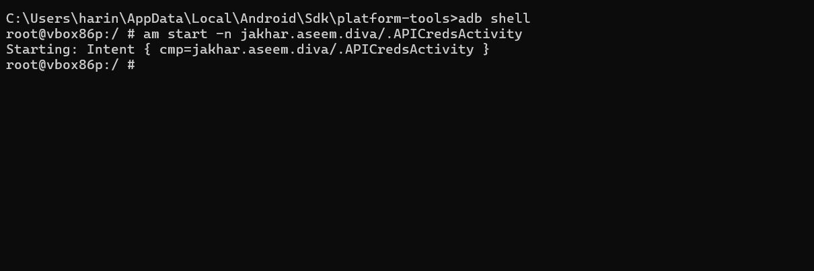

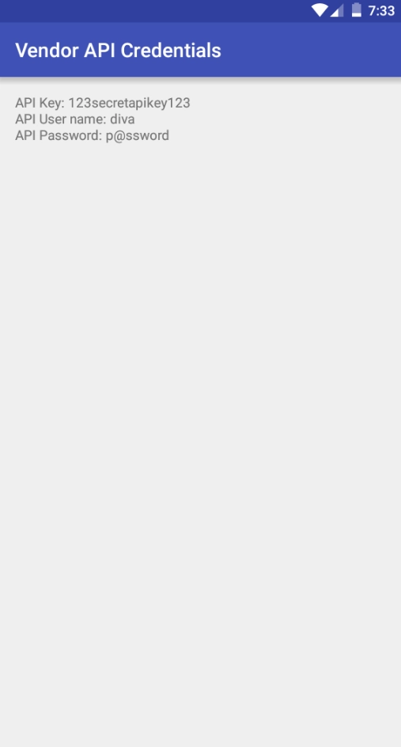

### The Fix

So instead of just relying on default settings. If a screen is meant to be private, they need to change the file type to android:exported=”false” inside the activity tag in the AndroidManifest.xml file, this line helps in overriding the intent filter and locks the screen down so no outside commands can launch it.

# *Level 10: Access Control Issues - Part 2*

### The Challenge

Just like the previous level, the app has a hidden screen that contains sensitive API credentials.

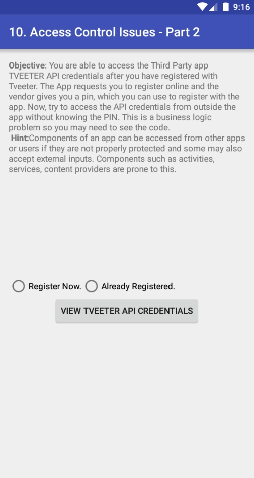

The screen was directly accessible in the previous level but in this level they have added a security check and the goal is to see if we can still force the screen to open from outside anyway.

### Understanding the Vulnerability

In Android, when one screen opens another, it can pass data along with it using something called an **Intent Extra**. The vulnerability here is the security check itself. The activity is still exported which makes it accessible for everyone but there is still a line which checks for a specific boolean(true/false) “Extra” to check if the button clicked by user is correct or not, but the problem is that the android activity manager allows attackers to easily attach fake “Extras” to their launch commands. Anyone who looks at the knows exactly what boolean the app is looking for, so they can just forge it.

### The Exploit

As I already knew this level is about an added security check, First I decompiled using jadx to analyze the code to figure out how the lock worked.

1. The first thing that I did was going through the AndroidManifest.xml file as that is the map for the app, I spotted an activity named .APICredsActivity2 and the activity was public by setting android:exported=”true”.
2. I went into the activity and tried to figure how the code worked I found the exact if condition  I was looking for, the app was checking the incoming intent for a specific boolean extra named check_pin. If the condition wasn’t met, the app blocks access.
3. As I have all the information now I just passed a boolean flag to make the condition evaluate to false, then I opened device shell and used the activity manager, but I added the  “—ez” flag to change the boolean.
Command :
adb shell
am start -n jakhar.aseem.diva/.APICredsActivity2 —ez check_pin false
4. The app accepted the forged intent and the hidden API Credentials were visible on the screen.

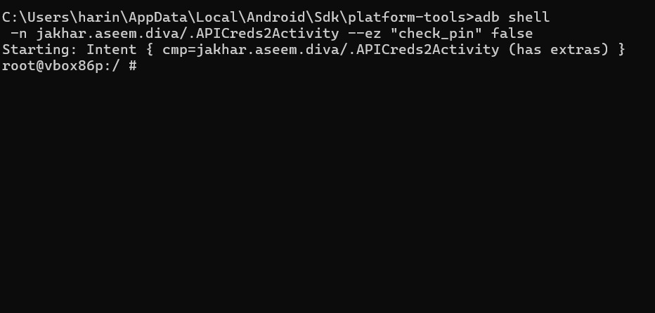

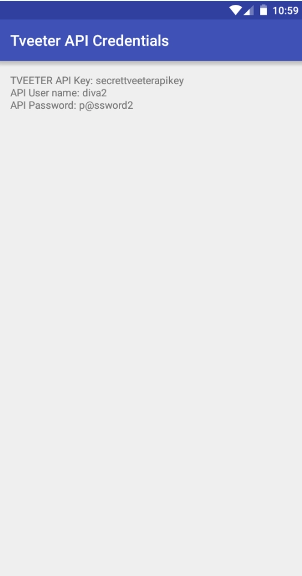

### The Fix

You can never rely on Extras for security if the activity is still open to the public. The Fix exactly remains exactly same as the previous level : they should set the permission of android:exported=”false” for this specific activity, If this is done whatever the external intents or Extras an outsider tries to send will be blocked by Android at the system level.

# *Level 11: Access Control Issues - Part 3*

### The Challenge

When you open Level 11, the app prompts you to enter a PIN to access private notes.

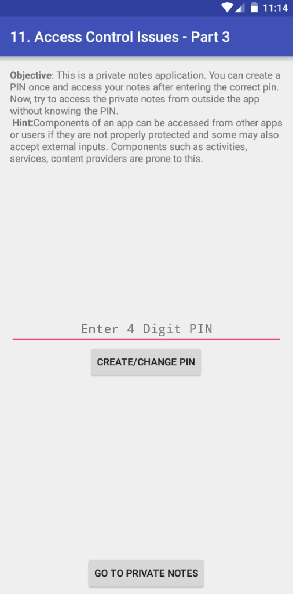

We need to find if the app is accidentally giving access to these private notes to the rest of the phone, allowing to steal the data without knowing the pin or even interacting with the screen.

### Understanding the Vulnerability

In Android, apps can share databases with each other using a feature called a **Content Provider**. The problem here is that they have setup a content provider for their internal notes database but did not lock it so, If a provider is left “exported” without requiring any special access permissions, it acts like an open megaphone. It will easily handover its sensitive data to any app or terminal user that asks for it, completely bypassing the app’s internal PIN check.

### The Exploit

I used adb commands to check if the app was broadcasting any vulnerable data pipelines.

1. First, I opened device shell and I used dumpsys command to dump all the package configuration details for DIVA directly from the OS and piped it straight into grep to instantly filter the exact keyword I needed
Command:
dumpsys package jakhar.aseem.diva | grep -i provider
2. I scrolled through the output looking for the providers section. I found one being broadcasted publicly and made a note of its exact authority name : “jakhar.aseem.diva.provider.notesprovider”.
3. Then I used the Android’s built-in content query command to directly ask the provider for everything it had in the notes table.
Command : content query —uri content://jakhar.aseem.diva.provider.notesprovider/notes
4. As there was no authorization check on the provider, it instantly dumped all the data onto my terminal screen.

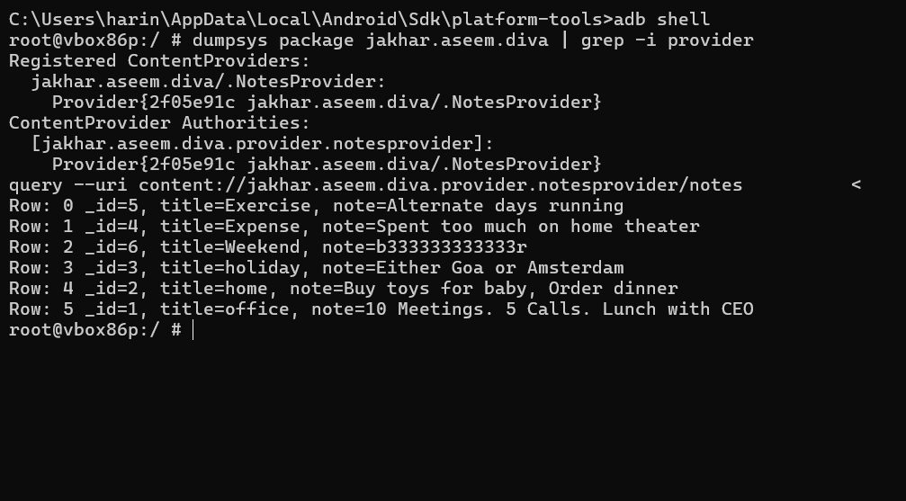

### The Fix

You cannot rely on a visual PIN screen to protect a database if the database itself is open to the system. In the AndroidMainfest.xml file, they need to find  the provider tag for the notes provider and explicitly set android: exported= “false”. This tells the Android OS to isolate the pipeline entirely, ensuring that only the DIVA app itself can access those notes.

# *Level 12: Hardcoding Issues - Part 2*

### The Challenge

When you open Level 12, the app simply gives you a text box and asks you to enter a secret "Vendor Key" to grant access.

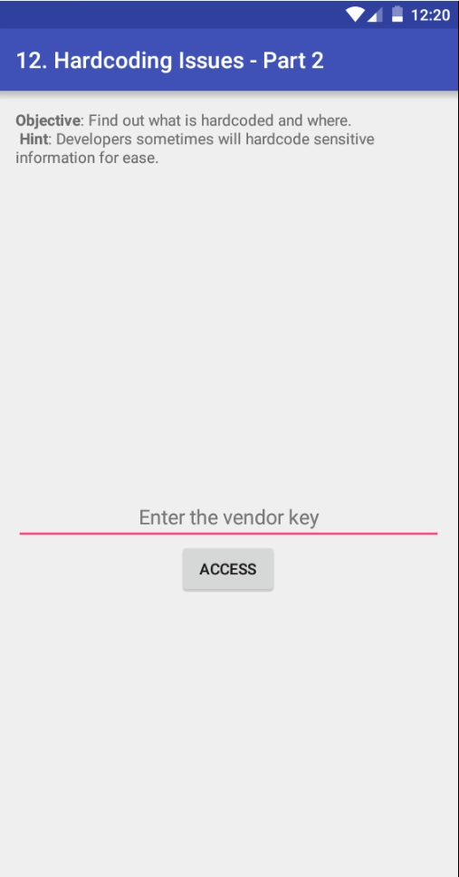

The goal of this level is to find this hidden key. Unlike the second level you won’t find anything in the normal Java code in Jadx, the key is nowhere to be found.

### Understanding the Vulnerability

In Level 2, the developer hardcoded a password directly into the Java code, which was incredibly easy to read. To "fix" this, they moved the secret key out of the Java code and put it into a native library which is a compiled C/C++ file(.so file) that Android apps use for heavier processing. The problem here is a concept called *Security by Obscurity*.  It’s like writing your password on a piece of paper, putting it in a box, and thinking it's safe just because the box is hard to open. Even though the file looks like unreadable gibberish to a human, any actual words or passwords inside the file stay exactly as the plain-text itself. Because the developer didn't actually encrypt the key.

### The Exploit

I first decompiled the app using **Jadx** to see how the "Access" button was checking my input.

1. I saw a function declaration : public native String accessControlCheck(String input);. The word native told me the logic wasn’t in the Java code, but in a separate C/C++ library.
2. I saw the line System.loadLibrary(”divajni”); this told me exactly which file to look for and that is libdivajni.so.
3. Then I just ran the strings commands against the file [libdivajni.so](http://libdivajni.so). This command is used to ignore the computer code and only shows readable text.
4. Looking through the output, I spotted a random-looking string that didn't belong olsdfgad;lh.
5. I went back to the live DIVA app, entered that string as the Vendor Key, and clicked Access and I got the access.

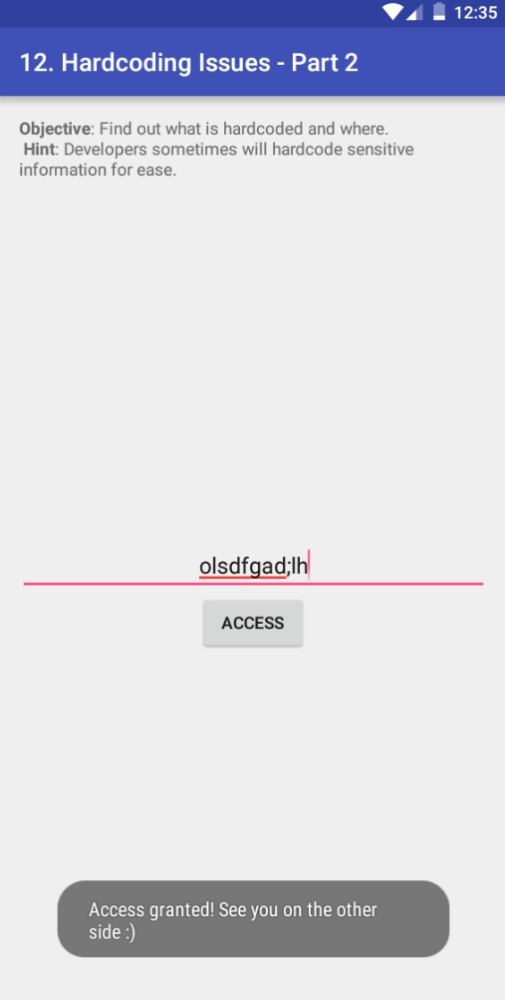

### The Fix

If a secret key is required, it should be fetched from a secure server or protected using the Android Keystore. If a string must be in a native library, it must be encrypted so it cannot be dumped using a basic terminal command like strings.

# Level 13: Input Validation Issues - Part 3

### The Challenge

For the final level, the app presents a simple text box and asks you to enter a launch code.

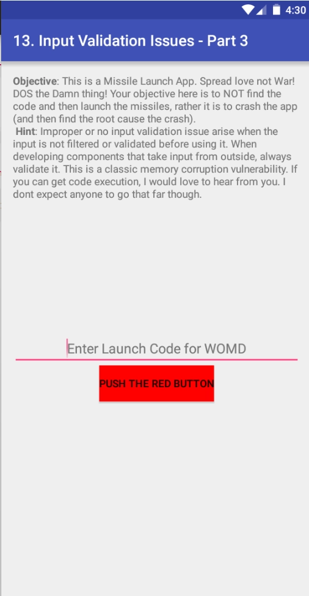

The goal of this level is to test the app’s stability and see if the underlying architecture can be broken by feeding it data it isn't prepared to handle

### Understanding the Vulnerability

In Level 12, we learned that this app routes data through a Native C/C++ Library (libdivajni.so). Unlike Java, which is a "memory-safe" language, C and C++ require the developer to manually manage memory sizes. So the vulnerability is the lack of input validation. They have created a memory buffer designed to hold a specific number of characters, but they never wrote code to check the length of the user’s input before accepting it, so if you just type a massive string of characters, the app blindly accepts it and tries to stuff into the tiny buffer. The extra text "spills over" and overwrites adjacent parts of the phone's memory. This is called a **Buffer Overflow**, and it causes the Android operating system to instantly kill the app to protect the device.

 

### The Exploit

Because I discovered in Level 12 that this application routes inputs through a native C/C++ library, I suspected a potential memory management flaw. To test this hypothesis, I intentionally gave the app a massive, oversized string of characters to see if the developer properly bounded their memory buffers.

1. Before opening the app I have opened my terminal and launched Android’s live system logger, cleared old logs and filtered for fatal system error
Command :
adb logcat -c
adb logcat | grep -i fatal
2. I went to the app and entered a lowercase letter “a” repeatedly, inputting a massive string of characters.
3. I submitted, then the app instantly froze and crashed back to the home screen, I went back to the terminal and the logcat feed had captured the exact moment of crash. The log displayed a Fatal signal 11 (SIGSEGV), proving a segmentation fault.
4. Most importantly, the error log explicitly stated the memory address where the crash happened fault addr 0x61616161. In hexadecimal computer language, 61 translates exactly to the lowercase letter “a”. This proves that the app took my excessively long input of “a”s and directly overwrote the application’s critical memory space.

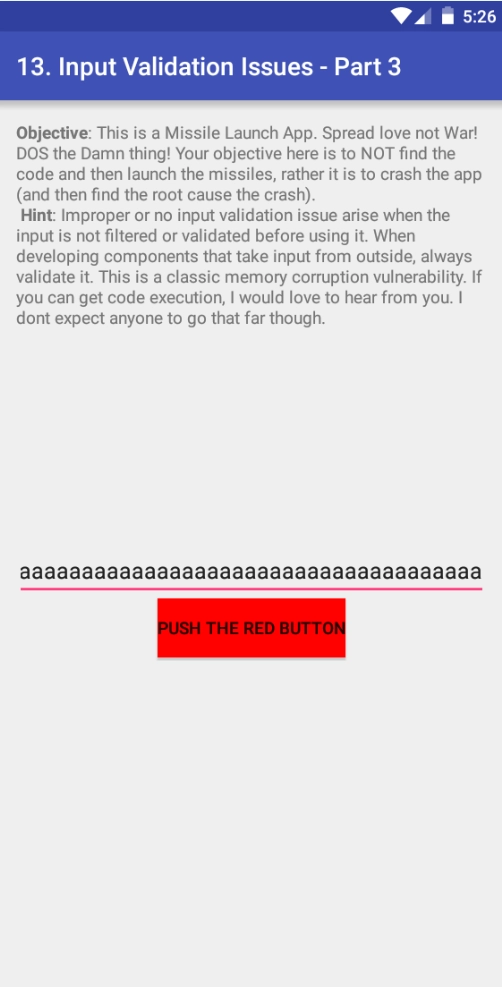

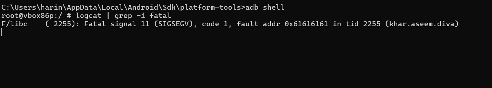

### The Fix

First, the developer should add a hard character limit to the actual text box on the screen. By simply setting a rule like "maximum 20 characters," the app physically prevents the user's keyboard from typing a massive string in the first place.

Second, the developer needs to fix the internal C/C++ library. Currently, they are using an old command that blindly copies whatever data it receives until it crashes. They must switch to a "safe" command that essentially says: *"*Copy this text, but forcibly stop copying after 20 characters.*"* This guarantees that even if an attacker bypasses the app screen, the memory will safely reject the extra text instead of overflowing and crashing the system.